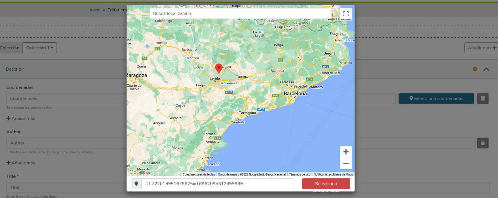

# Introducción

Este repositorio referencia desarrollos vinculados al proyecto GeoRebiun.

Incluye:

* Cambios necesarios para implementar un selector de coordenadas, principalmente en repositorios DSpace, para poder introducir metadatos geolocalizados según el formato usado.
* Alternativas para implementar este selector en otros software
* Cambios para mostrar los metadatos geolocalizados en la pantalla de ítem de DSpace
* Instrucciones para la exportación por OAI

## Últimos cambios añadidos

* 24/02/2026: Añadidas mejoras en versión 7.6 de selector de coordenadas para habilitar arrastre del mapa, vista satélite y permitir añadir coordenadas en nuevo campo
* 24/01/2025: instrucciones iniciales

## Metadato y formato

Para la geolocalización de documentos en repositorios DSpace, se utiliza el metadato Dublin Core **dc.coverage.spatial** con el siguiente formato:

```
 east=LONGITUD; north=LATITUD; name=NOMBRE
```

Por ejemplo, un documento con dos puntos geolocalizados incluirá los metadatos en este formato:

```
dc.coverage.spatial=	east=13.883333300000004; north=-14.3166667; name=Quilengues, Angola
dc.coverage.spatial=	east=14.448020000000042; north=-11.71077; name=Seles, Angola
```
Ver ejemplo en: [https://upcommons.upc.edu/handle/2117/10820?show=full](https://upcommons.upc.edu/handle/2117/10820?show=full)

# Implementación selector de coordenadas

Para facilitar la inclusión de estos metadatos se han preparado cambios para diferentes versiones de DSpace que incluyen un selector de coordenadas utilizando librerías de Google Maps.

Para poderlo utilizar es necesario registrar una ApiKey de Google Maps siguiendo los pasos descritos en:
[https://developers.google.com/maps/documentation/javascript/get-api-key?hl=ES](https://developers.google.com/maps/documentation/javascript/get-api-key?hl=ES)

**NOTA:** desde hace unos años Google requiere añadir una cuenta de facturación al solicitar el alta de la ApiKey, aunque por el uso que se da al selector es extraño superar el número de consultas gratuitas, para más seguridad se pueden configurar límites y restricciones de uso para no acarrear gastos.

A continuación se incluyen enlaces y comentarios para la implementación en diferentes versiones de DSpace:

## Versión 7.x

En versiones 7.x y posteriores los cambios se han desarrollado en el código de dspace-angular.

Incluye nuevas opciones de configuración a añadir a los archivos config.*.yml para incluir la ApiKey de Google, el metadato usado y el inicio del mapa:

```yml
locationPicker:
  googleApiKey: YOUR-GOOGLEMAP-API-KEY
  metadata: dc.coverage.spatial
  zoom: 8
  center:
    lat: 41.48378
    lng: 1.11369
```

Aunque es posible configurar el metadato utilizado, en una parte del código el metadato está añadido directamente y se debería modificar si se cambia (en src/app/shared/form/builder/parsers/onebox-field-parser.ts)

Una vez aplicado el cambio es necesario lanzar ```yarn install``` para descargar las nuevas librerías utilizadas.

El selector se incorpora tanto al formulario de entrada como al de edición para el campo dc.coverage.spatial. Este es el resultado esperado:

**Entrada:**



**Edición:**


**Versiones:**

* 7.6.x:
  * https://github.com/toniprieto/dspace-angular/commits/selector-coordenadas-7.6
  * Esta versión no incluye los cambios para añadir nuevos textos en los archivos i18n, consultar información primer commit para más información.

* 7.5:
  * https://github.com/toniprieto/dspace-angular/commits/selector-coordenadas-7.5

* 7.4:
  * https://github.com/toniprieto/dspace-angular/commits/selector-coordenadas-7.4-v1

## Versiones anteriores (5.x / 6.x)

Existe también cambios para versiones anteriores que utilizan XMLUI para la versión 5.x, y que se debería poder aplicar también en versiones 6.x.

https://github.com/toniprieto/DSpace/commits/5_x-selecciona-coordenadas/
(incluye también cambios para mostrar los puntos geolocalizados en el registro de ítem)

En este caso se debe sustituir el `<GOOGLE-API-KEY>` por una clave Google propia, en la siguiente línea:
https://github.com/toniprieto/DSpace/blob/d76a3f99a1876226fe11ffd5afb7694bf1dc1d2e/dspace-xmlui/src/main/webapp/static/coordenadas.html#L351

# Implementación del selector en otro software

En la carpeta html de este repositorio se incluyen dos archivos HTML de ejemplo para implementar un selector de coordenadas en otros software diferentes usando el mismo método implementado en DSpace:

* Formulario inicial: [form.html](/html/form.html)
* Pantalla con selector de coordenadas: [coordenadas.html](/html/coordenadas.html)

Como en el caso anterior, es necesario sustituir el `<GOOGLE-API-KEY>` por una clave Google propia en el archivo [coordenadas.html](/html/coordenadas.html)

# Mostrar mapa en pantalla de ítem con puntos geolocalizados

También se han desarrollado cambios para poder mostrar los puntos geolocalizados en la pantalla principal de un registro de DSpace. En este caso, se utiliza la librería Leaflet para mostrar un mapa con los puntos seleccionados:


**Versiones**

* 7.6.x
  * https://github.com/toniprieto/dspace-angular/commits/mostrar-mapa-coordenadas-7x/
  * Las instrucciones para aplicar el cambio están en la descripción del primer commit
  * Las instrucciones incluyen un paso para copiar imágenes de leaftlet para mostrarlas correctamente

* 5.x (6.x)
  * https://github.com/toniprieto/DSpace/commit/4a06de211f9430b0860ad89f22542ba6f77f29cf
  * Es un commit dentro de la rama que implementa el selector para la versión 5.x

# Exportación OAI

Para poder recolectar los registros con puntos geolocalizados para el proyecto GeoRebiun el repositorio debe servirlos a través de su servidor OAI con un punto de accesos dedicado o mediante un set específico que incluya todos estos documentos.

El formato del servidor OAI debe seguir las especificaciones OpenAire pudiendo utilizar la versión 3 o 4 de las guías:

## Template para datacite:geoLocations (v.4)

Para mostrar los puntos geolocalizados en el formato `oai_openaire` de la v4 en `<datacite:geoLocations>` se puede utilizar esta template:

```xml
<xsl:template name="GeoLocation_R">
    <xsl:if test="doc:metadata/doc:element[@name='dc']/doc:element[@name='coverage']/doc:element[@name='spatial']/doc:element/doc:field[@name='value']">
        <datacite:geoLocations>
            <xsl:for-each
                    select="doc:metadata/doc:element[@name='dc']/doc:element[@name='coverage']/doc:element[@name='spatial']/doc:element/doc:field[@name='value']">
                <xsl:variable name="locationname">
                    <xsl:choose>
                        <xsl:when test="contains(substring-after(.,'name='),';')">
                            <xsl:value-of select="substring-before(substring-after(.,'name='),';')"/>
                        </xsl:when>
                        <xsl:otherwise>
                            <xsl:value-of select="substring-after(.,'name=')"/>
                        </xsl:otherwise>
                    </xsl:choose>
                </xsl:variable>
                <xsl:variable name="longitude">
                    <xsl:choose>
                        <xsl:when test="contains(substring-after(.,'east='),';')">
                            <xsl:value-of select="substring-before(substring-after(.,'east='),';')"/>
                        </xsl:when>
                        <xsl:otherwise>
                            <xsl:value-of select="substring-after(.,'east=')"/>
                        </xsl:otherwise>
                    </xsl:choose>
                </xsl:variable>
                <xsl:variable name="latitude">
                    <xsl:choose>
                        <xsl:when test="contains(substring-after(.,'north='),';')">
                            <xsl:value-of select="substring-before(substring-after(.,'north='),';')"/>
                        </xsl:when>
                        <xsl:otherwise>
                            <xsl:value-of select="substring-after(.,'north=')"/>
                        </xsl:otherwise>
                    </xsl:choose>
                </xsl:variable>
                <datacite:geoLocation>
                    <datacite:geoLocationPoint>
                        <datacite:pointLongitude><xsl:value-of select="$longitude"/></datacite:pointLongitude>
                        <datacite:pointLatitude><xsl:value-of select="$latitude"/></datacite:pointLatitude>
                    </datacite:geoLocationPoint>
                    <datacite:geoLocationPlace>
                        <xsl:value-of select="$locationname"/>
                    </datacite:geoLocationPlace>
                </datacite:geoLocation>
            </xsl:for-each>
        </datacite:geoLocations>
    </xsl:if>
</xsl:template>
```

## Definir un set con registros geolocalizados

Se puede crear un set `geo` con los registros geolocalizados en DSpace con la siguiente configuración.

1. Crear una condición (dc.coverage.spatial que empiecen por `east=`)

```xml
<CustomCondition id="metadatosGeoCondition">
    <Class>org.dspace.xoai.filter.DSpaceAtLeastOneMetadataFilter</Class>
    <Configuration>
        <string name="field">dc.coverage.spatial</string>
        <string name="operator">starts_with</string>
        <string name="value">east=</string>
    </Configuration>
</CustomCondition>
```

2. Definir un filtro:
```xml
<Filter id="geoFilter">
    <Definition>
        <And>
            <LeftCondition>
                <Or>
                    <LeftCondition>
                        <Custom ref="itemAccessCondition"/>
                    </LeftCondition>
                    <RightCondition>
                        <Custom ref="itemWithdrawnCondition"/>
                    </RightCondition>
                </Or>
            </LeftCondition>
            <RightCondition>
                <Custom ref="metadatosGeoCondition"/>
            </RightCondition>
        </And>
    </Definition>
</Filter>
```

3. Declarar el set con el filtro creado:
```xml
<Set id="geo">
    <Spec>Geo</Spec>
    <Name>Geo set</Name>
    <Filter ref="geoFilter" />
</Set>
```

